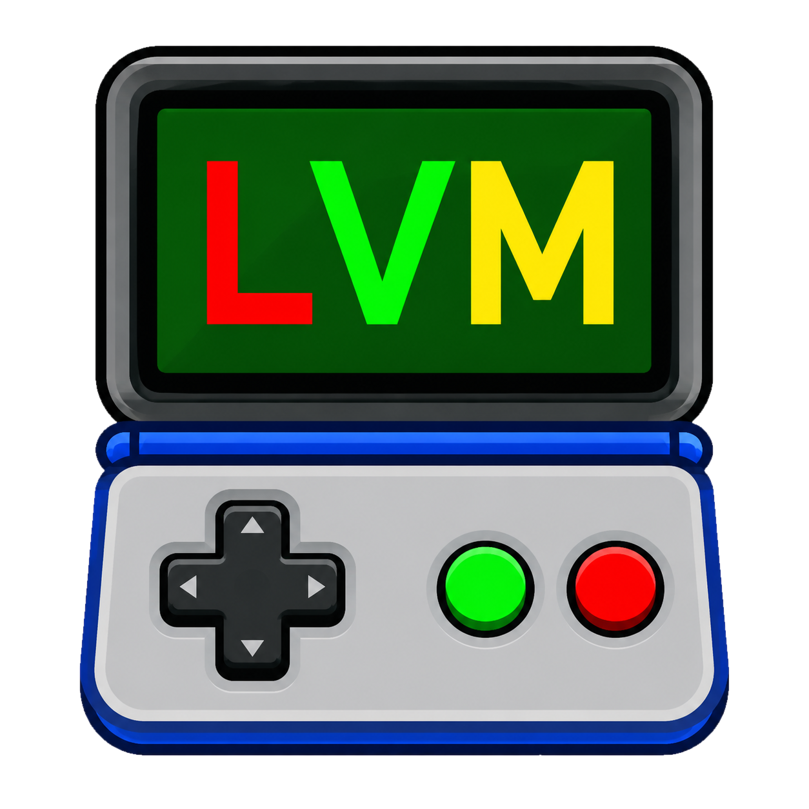
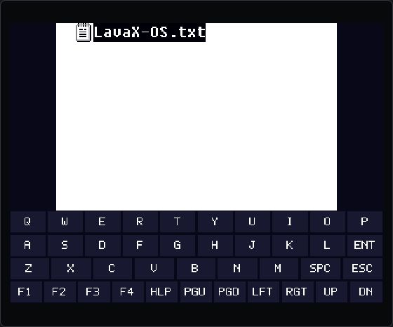
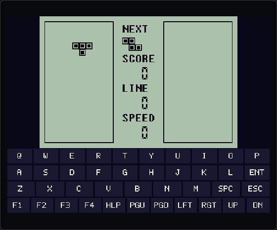
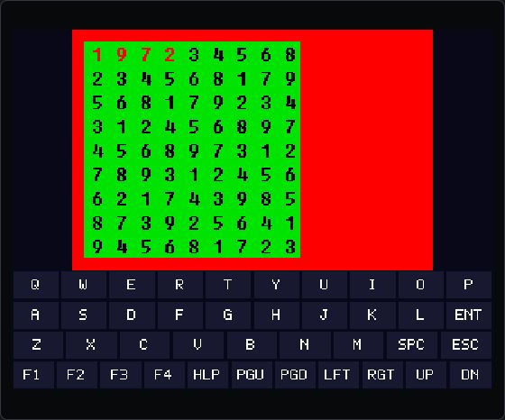

# LavaXVM for BBK 9588

<p align="center">
  
</p>

这是 LavaXVM 3.5 的步步高 9588 原生 BDA 移植版。VM 解释器直接以
MIPS BDA 运行，显示、实体键、触摸、时钟和文件系统由 9588 平台层实现。

## 当前实现

- 支持 LavaX 常见的 `160x80`（2 倍）和 `240x160` 画面，横屏旋转到 9588。
- 实体方向键随横屏方向映射；Enter/ESC 直接传给 LavaX。
- 屏幕下方提供 QWERTY、功能键、翻页键和方向软键盘。
- 触摸游戏区会转换成 LavaX 逻辑坐标，并与实体 ESC 输入隔离。
- 自动查找 `B:\LavaXOS`，找不到时回退到 `A:\LavaXOS`。
- 同时按住 Enter + ESC 1.5 秒退出 BDA。
- 使用重新设计的透明菜单图标，源图位于 `assets\lavax-icon.png`。

## 运行截图

| LavaXOS Shell | 俄罗斯方块 | 数独 |
| --- | --- | --- |
|  |  |  |

截图来自 9588 模拟器实机环境；运行系统与游戏文件不包含在本仓库中。

## 快速开始

1. 从 [最新 Release](https://github.com/HelloClyde/BBK9588-lavax/releases/latest)
   下载 `LavaX.bda` 和 `LavaXOS.zip`。
2. 通过设备正常的 BDA 安装方式安装 `LavaX.bda`；程序名称显示为 `LavaX`。
3. 解压 `LavaXOS.zip`，把其中完整的 `LavaXOS` 文件夹复制到 `B:\LavaXOS`；
   没有 B 盘时也可放到 `A:\LavaXOS`。
4. 确认至少存在 `LavaXOS\System\Shell.sys`，然后启动 `LavaX`。
5. 进入 Shell 后依次选择 `LAVA`、`Lava8`，再选择 `.lav` 游戏并按
   Enter/确定运行。按 ESC/退出返回上一级；同时按住 Enter + ESC 1.5 秒退出 BDA。

`LavaXOS.zip` 来自 GPL-2.0 的
[LavaXOS 上游目录](https://gitee.com/jacklee72/lavaxos/tree/master/LavaXOS)，包含系统、
应用和示例游戏，但已排除 `_NDS` 目录及所有 `.nds` 文件。Release 中的两个
`.sha256` 文件可分别校验 BDA 和运行包完整性。

如果需要从源码构建，请准备 Windows PowerShell、Git 和 Python 3：

```powershell
git clone https://github.com/HelloClyde/bbk9588-lavax.git
cd bbk9588-lavax
.\tools\bootstrap.ps1
.\tools\build.ps1 -Clean
```

构建结果为 `build\LavaX.bda`。

如需生成与 Release 相同的运行包：

```powershell
.\tools\package-runtime.ps1
```

脚本按 `deps.lock.psd1` 下载固定上游提交，输出 `build\LavaXOS.zip`，并验证包内
存在 `System\Shell.sys` 且不含 `_NDS` 或 `.nds` 文件。

## 选择游戏

正常启动后会进入 LavaXOS Shell 的根目录。用方向键选择 `LAVA`，按 Enter/确定进入，
再选择 `Lava8` 和其中的 `.lav` 游戏，按 Enter/确定启动；按 ESC/退出返回上一级。
`PROGRAM` 目录则用于浏览 LavaXOS 应用。

## 构建

```powershell
cd lavax-for9588
.\tools\bootstrap.ps1
.\tools\build.ps1 -Clean
```

`bootstrap.ps1` 会按 `deps.lock.psd1` 拉取固定版本的 SDK；也可通过
`BDA_SDK_ROOT` 指定已有 SDK。本仓库与
[bbk9588-bda-sdk](https://github.com/HelloClyde/bbk9588-bda-sdk) 由同一作者维护；后者提供
9588 BDA 的构建、打包和模拟器测试基础设施。
输出为 `build\LavaX.bda`。

仓库的 GitHub Actions 会在 `main`、Pull Request 和手动触发时验证构建。推送
任意 Tag（建议使用 `v0.1.0` 这样的版本号）后，会自动创建 GitHub Release，并附带
`LavaX.bda`、`LavaXOS.zip` 及各自的 SHA-256 校验文件：

```powershell
git tag v0.1.0
git push origin v0.1.0
```

启动隔离的 9588 模拟器测试 NAND：

```powershell
$env:BBK9588_EMULATOR_ROOT = 'C:\path\to\bbk9588-emulator'
.\tools\test-emulator.ps1 -ResetImage
```

模拟器中导入自有运行文件（模拟器必须已停止）：

```powershell
python .\tools\import-runtime-emulator.py C:\path\to\LavaXOS `
  --emulator-root C:\path\to\bbk9588-emulator `
  --nand C:\path\to\bbk9588-emulator\runtime\bda_test\bbk9588_nand.bin
```

脚本校验 `Shell.sys`，复制后复核文件，并明确排除 ROM 文件。
仅在隔离测试 NAND 中，可用 `--boot-program path\game.lav` 临时把指定游戏作为
Shell 启动，用于端口冒烟；它不会改动源目录。

## 放置运行文件

Release 提供从上游固定提交打包的 `LavaXOS.zip`。解压后把整个 `LavaXOS` 目录
复制到设备：

```text
B:\LavaXOS\System\Shell.sys
B:\LavaXOS\System\Config.ini
B:\LavaXOS\PROGRAM\...
```

也可以放在 `A:\LavaXOS`。BDA 与 `LavaXOS` 目录相互独立；运行包不含 NDS 文件，
也不要自行把 ROM 文件复制进 BDA。若缺少 `Shell.sys`，程序会显示可读的诊断页面
而不是黑屏。运行包内的 `SOURCE.txt` 记录来源和固定提交，`LICENSE` 为上游许可证。

## 已知边界

- 9588 SDK 当前没有公开、已验证的删除文件 API，所以 LavaX 的删文件操作返回失败；
  新建目录、读写、定位和枚举目录已实现。
- RTC 暂用 VM 启动后的软件时钟；不会修改设备系统时间。
- 声音仍是空实现（上游的 `c_beep` 本身也是空操作）。
- 首版目标是兼容官方 Shell 与普通 `.lav` 游戏；依赖双屏特性的个别程序可能需要单独适配。

第三方版本和许可边界见 [THIRD_PARTY.md](THIRD_PARTY.md)。

## 致谢

- 感谢 [原版 LavaXVM](https://github.com/leesoft-mirage/LavaXVM)，本项目以其 VM 设计与
  核心代码为基础。
- 感谢 [Nintendo DS 版本 LavaXOS](https://gitee.com/jacklee72/lavaxos)，为本次平台移植
  提供了重要参考。

## 许可证

本项目整体按 [GNU GPL v2.0](LICENSE) 发布。LavaXVM 的上游来源、固定版本和本地修改
说明见 [THIRD_PARTY.md](THIRD_PARTY.md)。LavaXOS 运行文件不直接提交到本仓库，
而是在发布时从固定上游提交打包；NDS 文件和其他 ROM 不包含在 Release 中。
